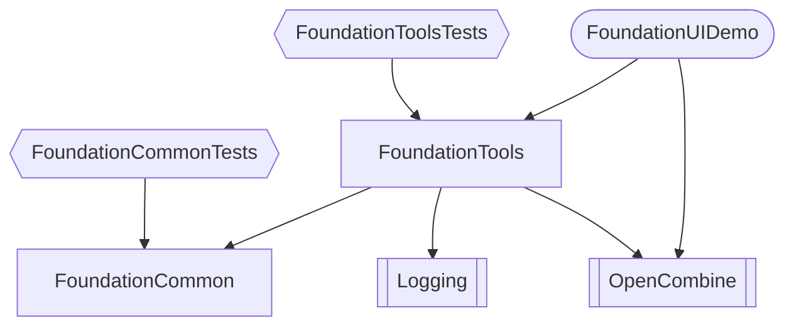

# Foundation Tools for Swift

Contains supporting code such as:
- common views for extending SwiftUI (macOS)
- cross bridging for commonality by directing to Swift-Cross-UI (Linux) or SwiftUI (macOS/iOS)

## Project Layout

