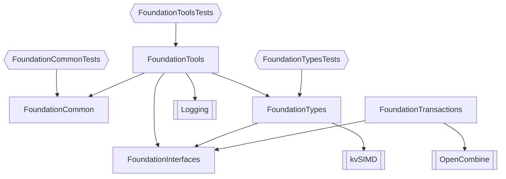

# Foundation Tools for Swift

KISS

## Project Layout

```mermaid
flowchart TD
    FoundationCommon
    FoundationInterfaces
    FoundationCommonTests{{FoundationCommonTests}}-->FoundationCommon
    FoundationTools-->FoundationCommon
    FoundationTools-->FoundationTypes
    FoundationTools-->FoundationInterfaces
    FoundationTools-->Logging[[Logging]]
    FoundationToolsTests{{FoundationToolsTests}}-->FoundationTools
    FoundationTypes-->FoundationInterfaces
    FoundationTypes-->kvSIMD[[kvSIMD]]
    FoundationTypesTests{{FoundationTypesTests}}-->FoundationTypes
    FoundationTransactions-->FoundationInterfaces
    FoundationTransactions-->OpenCombine[[OpenCombine]]
```